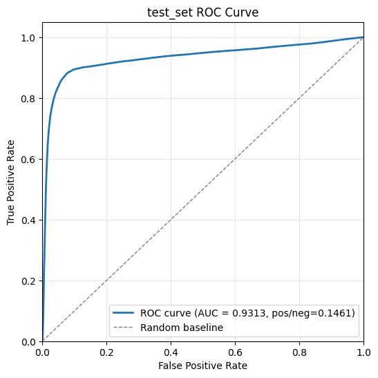
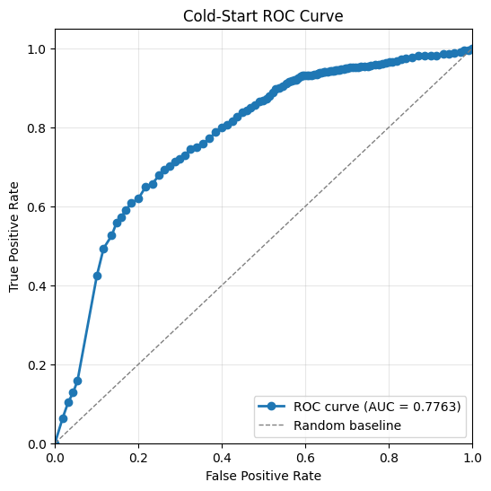

# recsys-retailrocket

[RetailRocket](https://www.kaggle.com/datasets/retailrocket/ecommerce-dataset) is a challenging dataset with rich information of item-side properties. With the help of AI coding tools, I managed to build a recommender system model with good performance on top of it within 2 days.

Highlights:
- AUC > 0.93 for whole test set and AUC > 0.77 for cold start test set.
- Optimized data pipeline for trainig time per epoch from 30 hours to 20 minutes.

  
  

This project builds a recommendation pipeline on top of the Retailrocket dataset, with a focus on learning item and user representations from product content and interaction history. The overall goal is to predict whether a user will view an item after a time cutoff, while keeping the representation simple to compute and practical for cold-start scenarios.

## Data

The dataset combines two main sources of information:

- User behavior from `events.csv`, including `view`, `addtocart`, and `transaction` events.
- Item metadata from the item property tables, which include numeric, categorical, and non-numeric attributes.

During preprocessing, the raw logs are converted into training-ready tables:

- `user_item.csv` stores user-item pairs and the prediction label.
- `user_events.csv` stores each user's historical interactions grouped by event type and time bucket.
- Bucketed property files store item features across several time windows before the cutoff date.
- The total time range of the events is 4.5 months. cutoff_date is the first day + 4 months.
- All events used in the training and testing are before the cutoff_date.
- Label is 1 if there is at least 1 view event of this user-item pair after cutoff_date, 0 other wise.
- cold-start is 1 if the item's earliest view event happened in the last 15 days.
- implicit negative samples are not considered in this experiments.

The preprocessing step also marks whether an item is a cold-start item. In this project, an item is treated as cold start if its first view appears on or after the cutoff date.

## Model

The model follows a content-based recommendation design. Item embeddings are built directly from item properties, including numeric features, category structure, and tokenized non-numeric attributes. User embeddings are then constructed from the embeddings of items the user has interacted with, separated by event type and recency bucket. A factorization machine (and L2 norm) is used on top of the final user and item embeddings for binary prediction. It is fast so I choose it aa a PoC model.

A content-based approach is a good fit here for several reasons:

- It is fast at inference time because an item can be represented directly from its own attributes without needing expensive nearest-neighbor search over all users or items.
- It natively supports missing values because the feature construction uses sparse/default slots when a property is absent.
- It handles item cold start naturally because a new item can still be embedded from its metadata even when it has little or no interaction history.

## Cold Start Handling

Item cold start is natively supported by this method. Since item embeddings are generated from product attributes rather than relying only on past interactions, the model can score new or rarely seen items as long as their metadata is available.

User cold start is only partially supported in principle. The model architecture can produce user representations from user-side features or prior behavior, but this dataset does not include user attributes. In practice, that means users with no interaction history are difficult to model well, because there is no side information available to infer their preferences before they interact with any product.
